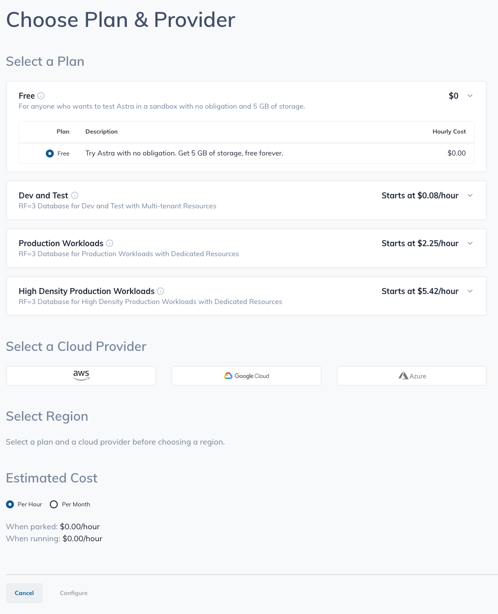
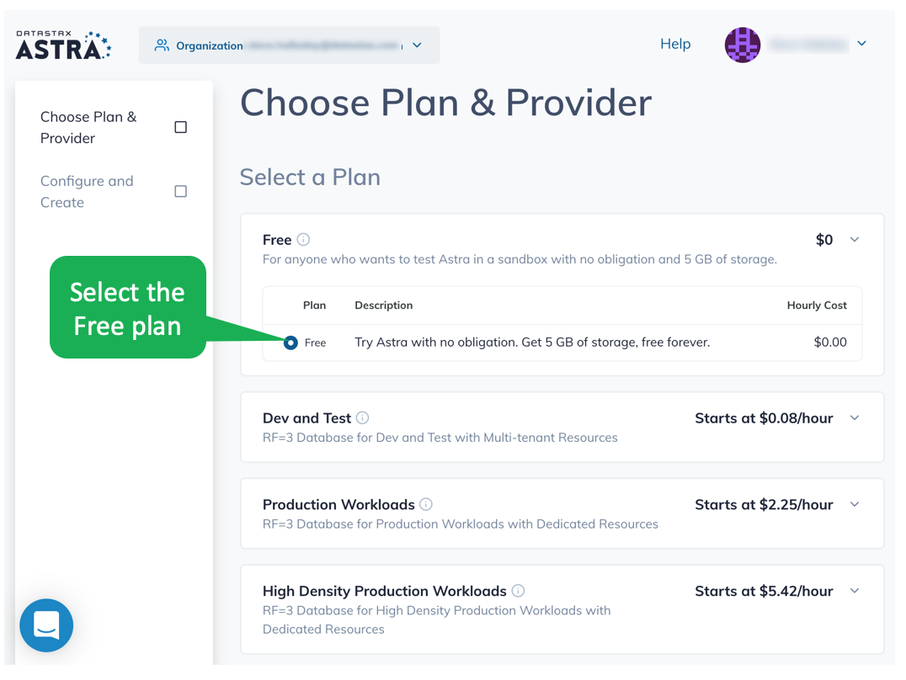
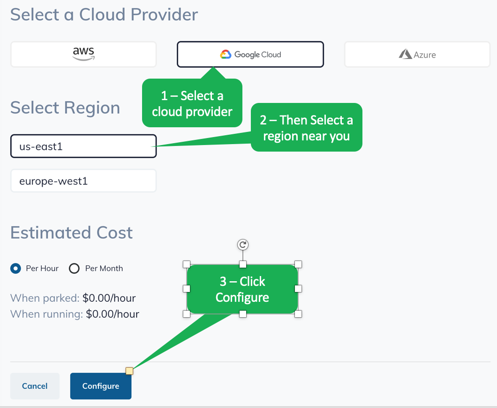
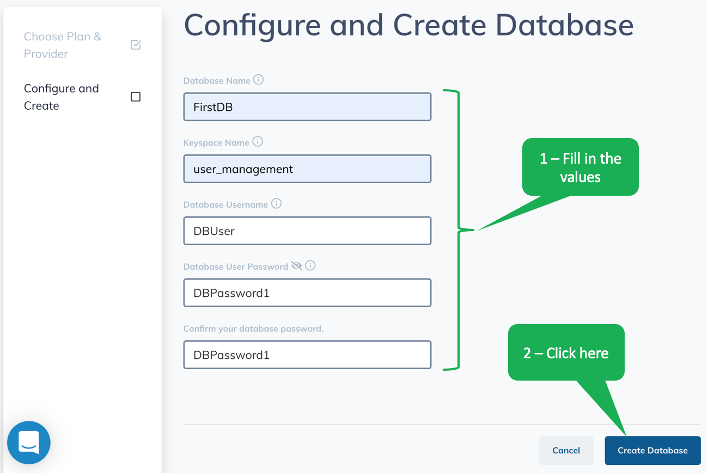
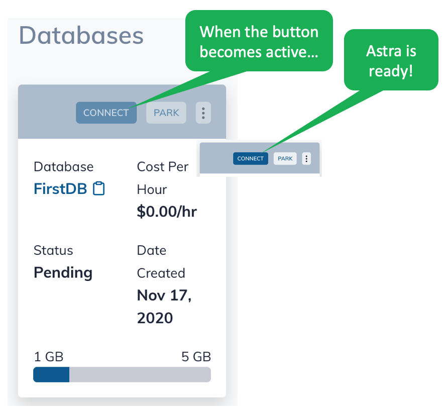

If you don't have an Astra account, set one up - it's easy.

Go to the Astra DB page in your browser [astra.datastax.com](https://astra.datastax.com/register?utm_source=devplay&utm_medium=katacoda&utm_campaign=astra-access).

Let's create the database.
Follow the steps outlined here.
To make life easy, we have recommended the values you should use for this scenario.

---

***NOTE:*** *If you already have an Astra DB database with values that differ from what we suggested, you may have to adapt some of the operations in this scenario accordingly, or create an additional keyspace with the designated values.*

---

If you don't already have an Astra DB database, when you log in the first time you'll see a screen that looks like the image below.

Configure your database by selecting the _Free_ plan.

Next, select a provider and region.
Then, click _Configure_.

Fill in the _Configure and Create Database_ fields with the following values.
Then, click the _Create Database_ button.
- Database name: FirstDB
- Keyspace name: user_management
- Database username: DBUser
- Database password: DBPassword1

You will see the list of databases with your newly created database.
While the database is initializing, the _CONNECT_ button is inactive, but becomes active once the database is ready.

It may take a minute for the database to deploy, but you'll get an email when it's ready.

## Congratulations! You have an active Cassandra database!
