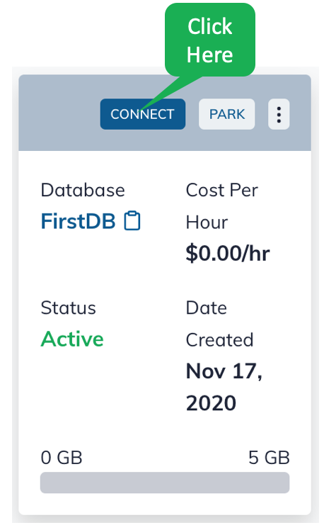
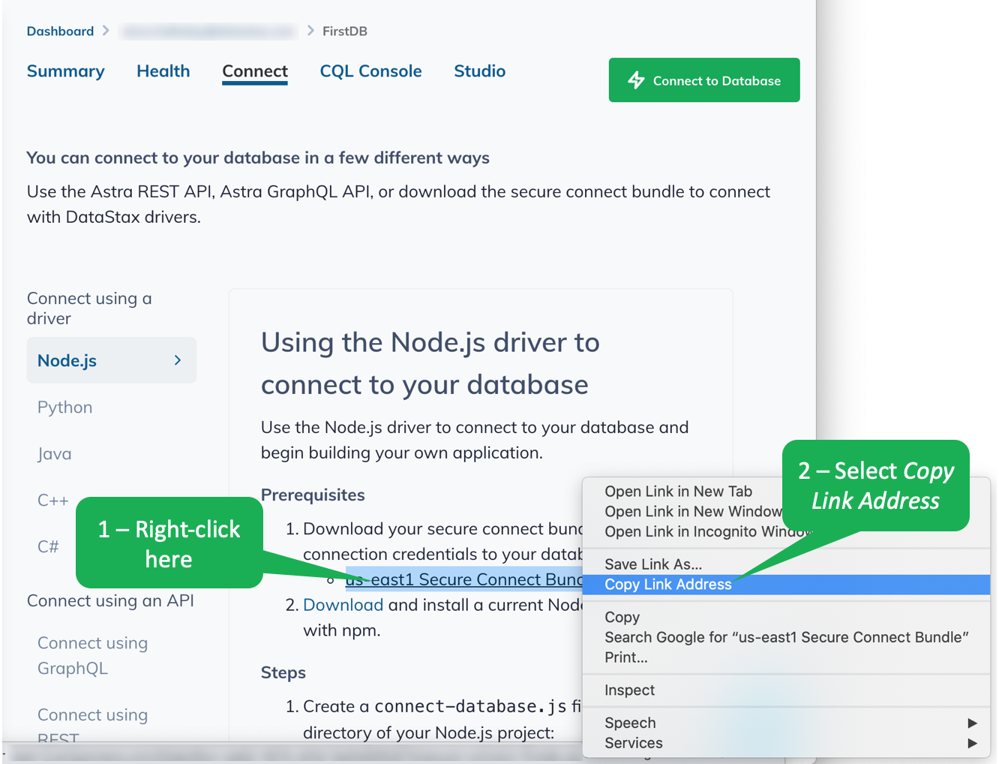

Let's build a Docker container that talks to Astra DB.
We'll use CQL Shell (`cqlsh`) to do the heavy lifting.

To get `cqlsh` working, we need to build a Dockerfile to do the following.
- Download the CQL Shell tarball
- Download the Astra secure connection bundle for your database
- Launch `cqlsh` with the correct credentials and security bundle

Let's build the `Dockerfile` together.
We'll create the `Dockerfile` a piece at a time.
Open the empty file by clicking the following.

 **Open** `Dockerfile`{{open}}

We'll start with the boilerplate for the Dockerfile.
`cqlsh` uses Python, so we'll base our Dockerfile on `python`.

<pre class="file" data-filename="Dockerfile" data-target="replace">
FROM python

</pre>

Next, let's set a directory as the root for all our work.
We'll store the directory location in an environment variable named `CQLSH_HOME`.

<pre class="file" data-filename="Dockerfile" data-target="append">
ENV CQLSH_HOME /root
</pre>

If the container is going to download the `cqlsh` tarball, we need to first install `wget`.
We use the `set -x` command so we can see the steps as they execute.

<pre class="file" data-filename="Dockerfile" data-target="append">
RUN set -x \
    apt-get update \
    && apt-get install -y wget \
    && rm -rf /var/lib/apt/lists/*
</pre>

Next, we're ready to grab the tarball.
We'll create a directory, download and unpack the tarball into the directory.
We also delete the tarball when we are done.

<pre class="file" data-filename="Dockerfile" data-target="append">
RUN set -x \
    && mkdir -p "$CQLSH_HOME" \
# Download CQL shell tarball
    && wget https://downloads.datastax.com/enterprise/cqlsh-astra.tar.gz \
# Unpack tarball
    && tar xvzf cqlsh-astra.tar.gz --directory ${CQLSH_HOME} \
    && rm -f cqlsh-astra.tar.gz
</pre>

We'll set up a couple of environment variables and set our working directory.

<pre class="file" data-filename="Dockerfile" data-target="append">
ENV HOME $CQLSH_HOME
ENV PATH $PATH:${CQLSH_HOME}/cqlsh-astra/bin
WORKDIR $HOME
</pre>

We want to use `docker run` command line arguments to download the secure connection bundle and to start `cqlsh`.
We'll use a simple shell script to allow us to use the command line arguments where we need them.
The command line arguments include.
- <code>$1</code> The database username (e.g., DBUser)
- <code>$2</code> The link to the secure connections bundle (we'll show you how to get this)

Here's the simple shell script named `cqlsh_run.sh`.
Please click the following to open the file.

 **Open** `cqlsh_run.sh`{{open}}

Finally, back in the Dockerfile, we end by copying the shell script to our working directory and launching the shell script.
Docker passes all the `docker run` command line arguments directly into the shell script for us.
Please click the following to open the file.

 **Open** `Dockerfile`{{open}}

<pre class="file" data-filename="Dockerfile" data-target="append">
COPY cqlsh_run.sh $WORKDIR
ENTRYPOINT ["./cqlsh_run.sh"]
</pre>

In the terminal, you can see the `Dockerfile` and the shell script.

`ls -al`{{execute}}

We can use the `Dockerfile` to build the container.

`docker build --tag cqlsh .`{{execute}}

We are almost ready to run the container.
When we run the container, we need the link to Astra's secure connection bundle from our clipboard.
To get ready, copy the following and paste it in the terminal, but DO NOT EXECUTE THIS COMMAND YET!!!!!!!!!!!!!!!

`docker run -it cqlsh DBUser "<place link here>"`{{copy}}

We need to grab the secure connection bundle from Astra and paste in into the command as indicated.
Follow the steps here to copy the link to your clipboard.
Note that this link is time-sensitive, so you need to complete the next couple of steps without delay.

To get the link to the secure connection bundle, on the Astra dashboard page, click on the _CONNECT_ button.

Right-click on the _Secure Connection Bundle_ link and select _Copy Link Address_.
This places the link to the secure connection bundle on the clipboard, which you will now paste into the _curl_ command.
Note that this link is time-sensitive, so you need to complete the next couple of steps without delay.

Back in the terminal, replace `<place link here>` with the clipboard contents.
A few things to note.
- The link is lengthy, that's OK
- Be sure to keep the double quotes surrounding the link

Once you have modified the `docker run` command with the link, execute the command.

You will need to supply the database password.
If you following our instructions when you set up the database, the password is `DBPassword1`{{copy}}

## Outstanding! You are connected to Astra!
