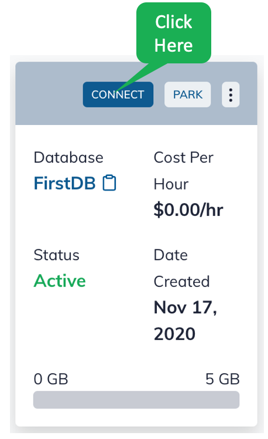
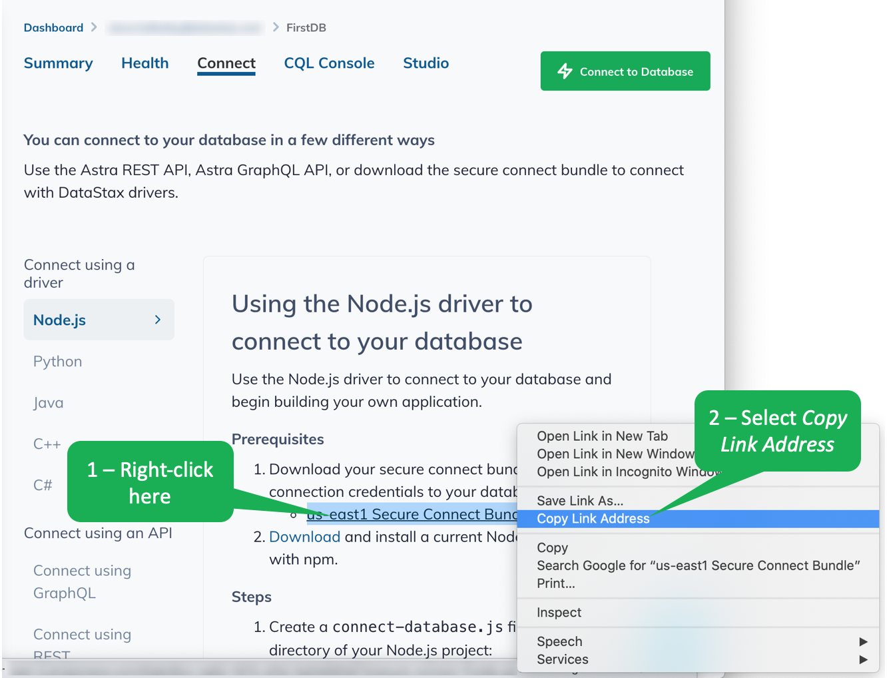
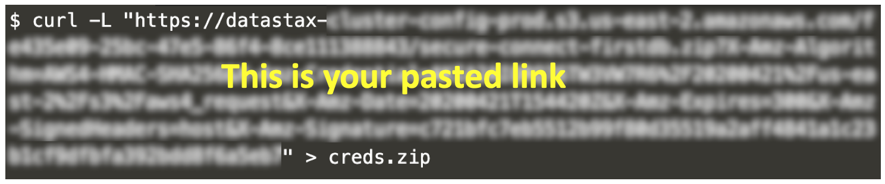

Let's download `cqlsh` and configure it to work with your Astra DB database.
Here's the command to download and unpack `cqlsh`.

`wget https://downloads.datastax.com/enterprise/cqlsh-astra.tar.gz
tar xvzf cqlsh-astra.tar.gz`{{execute}}

Let's add `cqlsh` to our path.

`export PATH=$PATH:/root/cqlsh-astra/bin`{{execute}}

We want to have a secure connection between `cqlsh` and our Astra DB database.
We'll set that up here.

Astra DB provides a secure connection bundle you will want to download.
Here's the command, but notice you will need to replace _<paste link here>_ with a link to the secure bundle.
Copy this command and paste it in the terminal window, but DO NOT EXECUTE THE COMMAND YET!!!!!!

`curl -L "<paste link here>" > creds.zip`{{copy}}

To get the link to the secure connection bundle, on the Astra dashboard page, click on the _CONNECT_ button.



Right-click on the _Secure Connection Bundle_ link and select _Copy Link Address_.
This places the link to the secure connection bundle on the clipboard, which you will now paste into the _curl_ command.
Note that this link is time-sensitive, so you need to complete the next couple of steps without delay.



Now, go back to the terminal tab.
Paste the link (the one you just copied) into the `curl` command as indicated - be sure to include the double quotes.
The curl command with the link will look something like this.



Once you have pasted the link, execute the `curl` command.

Check the size of the downloaded file.

```
ls -l creds.zip
```{{execute}}

The _creds.zip_ file should be about 12KB.
If it's not, the link may have expired, so refresh the Astra DB web page to update the link.
Then, grab the link and curl the file again by repeating the previous steps.

Finally, you can start the CQL shell with the following command.
You will be prompted for the necessary password.
If you followed our instructions when you created the database, the password is `DBPassword1`{{copy}}.

`cqlsh --secure-connect-bundle=creds.zip -u DBUser`{{execute}}

## Outstanding! You are connected to Astra DB!
