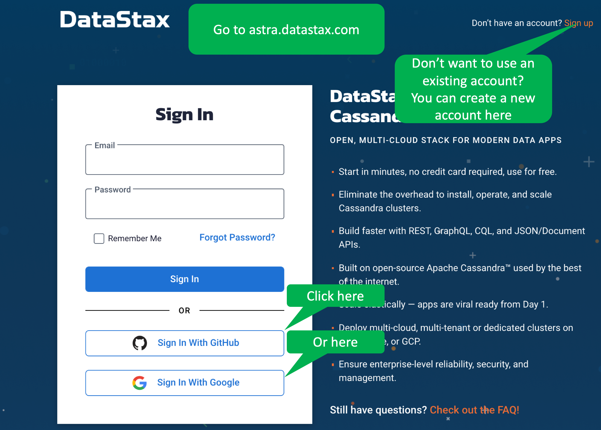
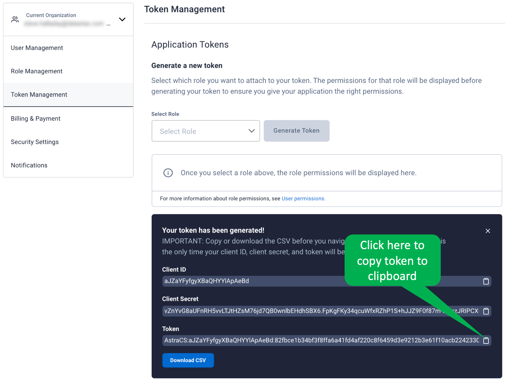

Let's try an operation on Astra DB just to see what it's like!

We'll use the Astra DB DevOps API to list the available regions for our organization and user.

<details>
  <summary style="color:teal"><b>What is the Astra DB DevOps API?</b></summary>
  <hr>
  The Astra DB DevOps API lets you manage the Astra DB database life cycle.
  You can perform actions like the following:
  <ul>
  <li>List, create, and terminate databases</li>
  <li>Add a keyspace to a database</li>
  <li>Park and unpark a database</li>
  <li>Get an organization and user's supported regions</li>
  </ul>
  You can find more information in the [DevOps docs](https://docs.datastax.com/en/astra/docs/_attachments/devopsv1.html).
  <hr>
</details>

Follow these steps (as seen in the video) to create a new application token.

<details>
  <summary style="color:teal"><b>Step 1. Login to Astra.</b></summary>
  <hr>

  Open a tab in the browser for [Astra](http://astra.datastax.com).
  You can login using a GitHub or Google account, or create a new Astra account.
  <hr>
</details>



<details>
  <summary style="color:teal"><b>Step 2. Find the _Organization Settings_.</b></summary>
  <hr>
  From the _Current Organization_ drop-down, select _Organization Settings_.
  <hr>
</details>


<details>
  <summary style="color:teal"><b>Step 3. Access _Token Management_.</b></summary>
  <hr>
  In the left-navigation list, select _Token Management_.
  <hr>
</details>


<details>
  <summary style="color:teal"><b>Step 4. Generate a new application token.</b></summary>
  <hr>
  From the _Select Role_ drop-down menu, select _Database Administrator_.
  Click the _Generate Token_ button.
  <hr>
</details>


<details>
  <summary style="color:teal"><b>Step 5. Copy the application token.</b></summary>
  <hr>
  Click on the clipboard icon near the right edge of the token to copy the token to your clipboard.
  Please note that, as a security precaution, you will only be able to copy this token once.
  So, please take care not to overwrite the token until you have completed the next step.
  <hr>
</details>



<details>
  <summary style="color:teal"><b>Step 6. Copy the export command to the terminal.</b></summary>
  <hr>
  Click the following to copy the export command to the terminal.
  Clicking will not yet execute the command, as we still need to paste the token on the end of the command before executing it.
  <hr>
</details>

```
export APP_TOKEN=
```{{execute no-newline}}

<details>
  <summary style="color:teal"><b>Step 7. Paste the token and execute the command.</b></summary>
  <hr>
  Paste the token value from the clipboard on the end of the export command by right-clicking in the terminal and selecting _Paste_.
  <hr>
</details>


If your environment variable is set correctly, the following command displays the token.

```
echo $APP_TOKEN

```{{execute}}

With your token set, we can now execute the following cURL command to query the available regions.

```
curl --request GET \
 --url "https://api.astra.datastax.com/v2/availableRegions" \
 --header "Accept: application/json" \
 --header "Authorization: Bearer $APP_TOKEN" | jq
```{{EXECUTE}}

If you want to clean things up, go back to the Astra UI.

As seen in the video, click the _X_ in the top-right corner of the panel displaying the token.
Finally, delete the token by clicking ellipses at the right of the token you just created and selecting _Delete_.

## The Astra DB DevOps API is easy to use and useful!
