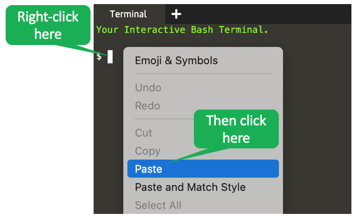
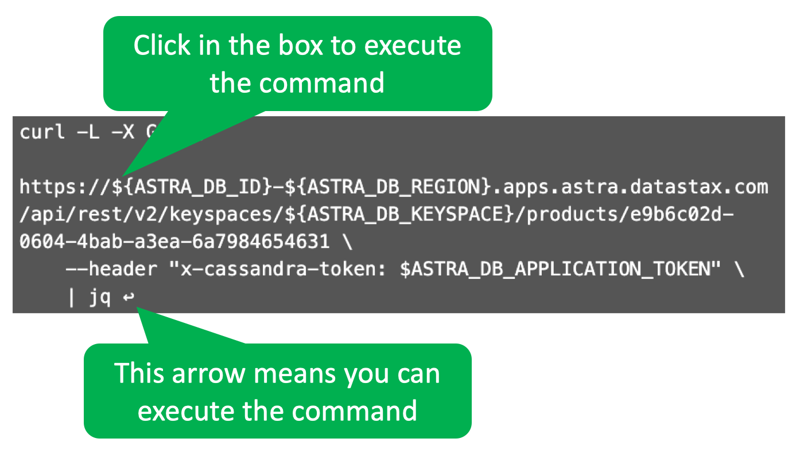
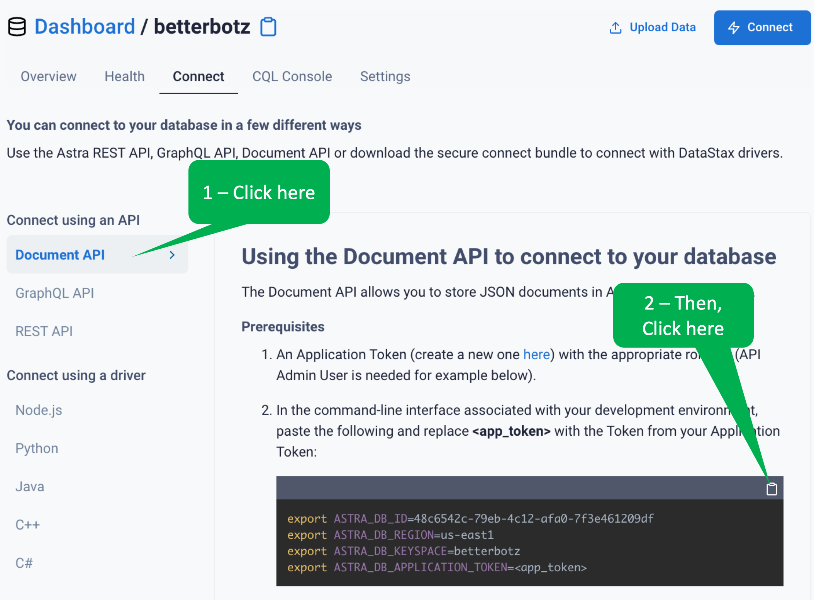
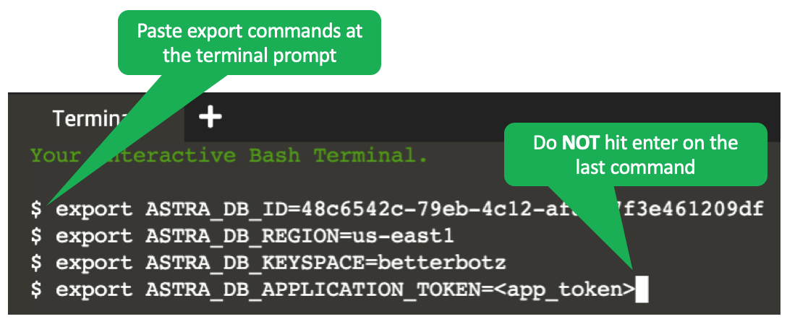

Let's get coding!


---

<p><span style="color:teal">***Note:***</span> *
In this exercise, we will be using cURL commands in the terminal.
The GraphQL section of the Astra DB User Interface explains how to do operations using GraphQL Playground, which is also a great tool.
Because we are using cURL instead of GraphQL Playground in this scenario, we will sometimes refer you to the Document API section of the Astra DB UI to copy some commands, etc. for setting up the environment.
These commands will work fine for the GraphQL API as well as the Document API.
We point this out here to avoid any confusion.
*</p>

---


<details>
  <summary style="color:teal"><b>New to our scenarios? Click here for three easy tips.</b></summary>
  <hr>

<b>Tip 1</b> - You can click lines that begin with a triangle (like the following) to see further explanation.
<details>
  <summary style="color:teal"><b>Try clicking on this line.</b></summary>
This is where you would find further explanation.
</details>
<br>

<b>Tip 2</b> - To paste content into the terminal, right-click in the terminal on the right-hand side of the screen and select _Paste_.

<br>

<b>Tip 3</b> - If a dark box has a bent arrow at the end, you can execute the command in that box by clicking on the box.
The scenario will copy the command to the terminal and begin execution.


<br>
After you execute the command, the bent arrow changes to a check mark.
<br>
<br>
<b>Bonus Tip!</b> - You can click on images to enlarge them.
<br>
<br>

<h3>Thats it! You're good to go!<h2>
<hr>
</details>

<details>
  <summary style="color:teal"><b>Step 1. Login to Astra.</b></summary>
  <hr>

  Open a tab in the browser for [Astra](http://astra.datastax.com).
  You can login using a GitHub or Google account, or create a new Astra account.
  <hr>
</details>


<details>
  <summary style="color:teal"><b>Step 2. Go to the Connection tab of your Astra DB database.</b></summary>
  <hr>
  From the Astra DB dashboard, click on the database name.
  Then, click the _Connect_ tab.
  <hr>
</details>


<details>
  <summary style="color:teal"><b>Step 3. Copy the environment variables from the Astra DB Connect tab.</b></summary>
  <hr>
  From the _Connect_ tab, click _Document API_ from the navigation on the left.
  Under _Step 2_ of the _Prerequisites_, click the copy icon to copy all the export commands.
  <hr>
</details>




<details>
  <summary style="color:teal"><b>Step 4. Paste the export commands into the terminal.</b></summary>
  <hr>
  Back in the Katacoda terminal, paste the contents of the clipboard at the terminal prompt.
  All but the last of these export commands will execute.
  Do NOT execute the final command yet - we need to replace <i>&lt;app_token&gt;</i> before we can execute it.
  <hr>
</details>



---

<p><span style="color:teal">***Note:***</span> *Do NOT execute the final export command yet!*</p>

---


<details>
  <summary style="color:teal"><b>Step 5. Find the _Organization Settings_.</b></summary>
  <hr>
  From the _Current Organization_ drop-down, select _Organization Settings_.
  <hr>
</details>


<details>
  <summary style="color:teal"><b>Step 6. Access _Token Management_.</b></summary>
  <hr>
  In the left-navigation list, select _Token Management_.
  <hr>
</details>


<details>
  <summary style="color:teal"><b>Step 7. Generate a new application token.</b></summary>
  <hr>
  From the _Select Role_ drop-down menu, select _Database Administrator_.
  Click the _Generate Token_ button.
  <hr>
</details>


<details>
  <summary style="color:teal"><b>Step 8. Copy the application token.</b></summary>
  <hr>
  Click on the clipboard icon near the right edge of the token to copy the token to your clipboard.
  Please note that, as a security precaution, you will only be able to copy this token once.
  So, please take care not to overwrite the token until you have completed the next step.
  <hr>
</details>


<details>
  <summary style="color:teal"><b>Step 9. Replace <i>&lt;app_token&gt;</i> with the application token and execute the command.</b></summary>
  <hr>
  Return to the Katacoda terminal.
  Delete <i>&lt;app_token&gt;</i> at the end of the final _export_ command.
  Paste the copied token into the terminal at the end of the _export_ command and hit enter to execute the command.
  <hr>
</details>


If the application token variable is set correctly, the following command displays the token value.

```
echo $ASTRA_DB_APPLICATION_TOKEN

```{{execute}}
<hr>
</details>

## Fantastic! The environment variables are ready to go!
