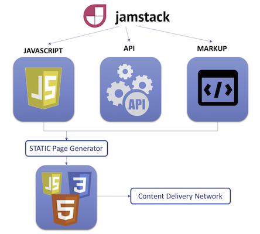

Interested in seeing a real application leveraging Stargate APIs on DataStax Astra DB? Welcome to BattleStax, an online party game you can enjoy with your friends. Battlestax is implemented as a JAMStack app that uses Stargate, Netlify functions, Astra DB, and GitHub to demonstrate how to build and deploy an application using modern, scalable architectures.

Stargate is about giving you the API you want for your Astra DB database.
In this example, we can use the Document API to save and search schemaless JSON documents in Cassandra.

#### Before we begin
As a prerequisite, be sure to setup an Astra account and create a Cassandra as a Service database at [astra.datastax.com](https://astra.datastax.com/register?utm_source=devplay&utm_medium=katacoda&utm_campaign=astra-core-course).

Watch this video on [How to Create a Database with Astra DB in 2 minutes](https://www.youtube.com/watch?v=fGgifHdAL2I) if you need more help.

In this scenario we will:
* Create a mock serverless REST endpoint that exposes a document API
* Create an `insertGame` endpoint and connect to Astra DB
* Run TDD tests

Let's learn how to create serverless endpoints using Netlify functions in a development environment.
