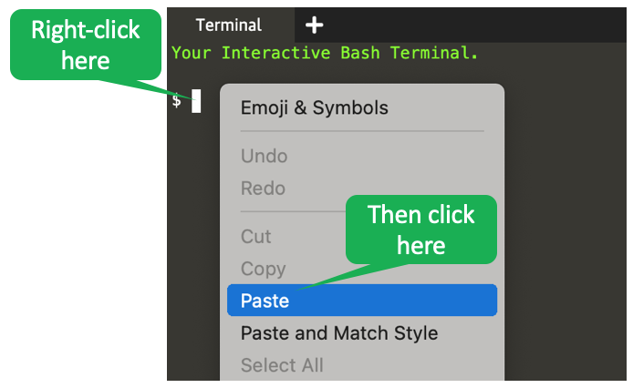
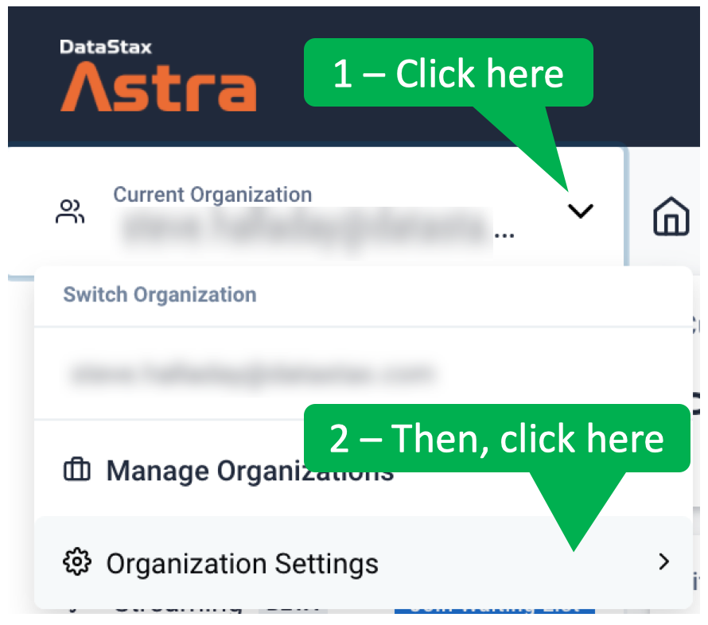

First of all, we will need set up some environment variables to help simplify our REST API access.
You must have already created an [Astra](https://astra.datastax.com/register?utm_source=devplay&utm_medium=katacoda&utm_campaign=astra-core-course) database and keyspace to complete this step.


---

<p><span style="color:teal">***Note:***</span> *
For production environments, it may be preferable to configure the environment using an _.env_ file.
However, to keep things simple in this exercise, we will merely use environment variables.
*</p>

---


<details>
  <summary style="color:teal"><b>New to our scenarios? Click here for three easy tips.</b></summary>
  <hr>

<b>Tip 1</b> - You can click lines that begin with a triangle (like the following) to see further explanation.
<details>
  <summary style="color:teal"><b>Try clicking on this line.</b></summary>
This is where you would find further explanation.
</details>
<br>

<b>Tip 2</b> - To paste content into the terminal, right-click in the terminal on the right-hand side of the screen and select _Paste_.

<br>

<b>Tip 3</b> - If a dark box has a bent arrow at the end, you can execute the command in that box by clicking on the box.
The scenario will copy the command to the terminal and begin execution.


<br>
After you execute the command, the bent arrow changes to a check mark.
<br>
<br>
<b>Bonus Tip!</b> - You can click on images to enlarge them.
<br>
<br>

<h3>Thats it! You're good to go!<h2>
<hr>
</details>

Follows these steps to set the environment variables.

<details>
  <summary style="color:teal"><b>Step 1. Login to Astra.</b></summary>
  <hr>

  Open a tab in the browser for [Astra](http://astra.datastax.com).
  You can login using a GitHub or Google account, or create a new Astra account.
  <hr>
</details>


<details>
  <summary style="color:teal"><b>Step 2. Go to the Connection tab of your Astra DB database.</b></summary>
  <hr>
  From the Astra DB dashboard, click on the database name.
  Then, click the _Connect_ tab.
  <hr>
</details>


<details>
  <summary style="color:teal"><b>Step 3. Copy the environment variables from the Astra DB Connect tab.</b></summary>
  <hr>
  From the _Connect_ tab, click _Document API_ from the navigation on the left.
  Under _Step 2_ of the _Prerequisites_, click the copy icon to copy all the export commands.
  <hr>
</details>


<details>
  <summary style="color:teal"><b>Step 4. Paste the export commands into the terminal.</b></summary>
  <hr>
  Back in the Katacoda terminal, paste the contents of the clipboard at the terminal prompt.
  All but the last of these export commands will execute.
  Do NOT execute the final command yet - we need to replace <i>&lt;app_token&gt;</i> before we can execute it.
  <hr>
</details>


---

<p><span style="color:teal">***Note:***</span> *Do NOT execute the final export command yet!*</p>

---


<details>
  <summary style="color:teal"><b>Step 5. Find the _Organization Settings_.</b></summary>
  <hr>
  From the _Current Organization_ drop-down, select _Organization Settings_.
  <hr>
</details>



<details>
  <summary style="color:teal"><b>Step 6. Access _Token Management_.</b></summary>
  <hr>
  In the left-navigation list, select _Token Management_.
  <hr>
</details>


<details>
  <summary style="color:teal"><b>Step 7. Generate a new application token.</b></summary>
  <hr>
  From the _Select Role_ drop-down menu, select _Database Administrator_.
  Click the _Generate Token_ button.
  <hr>
</details>


<details>
  <summary style="color:teal"><b>Step 8. Copy the application token.</b></summary>
  <hr>
  Click on the clipboard icon near the right edge of the token to copy the token to your clipboard.
  Please note that, as a security precaution, you will only be able to copy this token once.
  So, please take care not to overwrite the token until you have completed the next step.
  <hr>
</details>


<details>
  <summary style="color:teal"><b>Step 9. Replace <i>&lt;app_token&gt;</i> with the application token and execute the command.</b></summary>
  <hr>
  Return to the Katacoda terminal.
  Delete <i>&lt;app_token&gt;</i> at the end of the final _export_ command.
  Paste the copied token into the terminal at the end of the _export_ command and hit enter to execute the command.
  <hr>
</details>


We need to set one more variable that is specific to our application.

```
export GAMES_COLLECTION=games
```{{execute}}


Verify the environment variables are set correctly.

```
echo $ASTRA_DB_ID
echo $ASTRA_DB_REGION
echo $ASTRA_DB_KEYSPACE
echo $ASTRA_DB_APPLICATION_TOKEN
echo $GAMES_COLLECTION

```{{execute}}
<hr>
</details>


---

<p><span style="color:teal">***Note:***</span> *
A keyspace is equivalent to a namespace when using the Document API.
You need to use an empty keyspace or a keyspace with only documents for this scenario.
*</p>

---


## Fantastic! The environment variables are ready to go!
