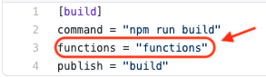
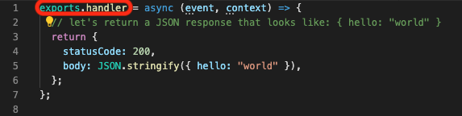
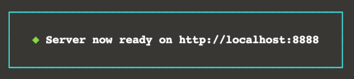

<br>
<center>
  
</center>

The REST API is stateless, and therefore helps functions scale horizontally. In this step, we are going to make a serverless endpoint using Netlify functions and the Stargate REST API.

<details>
<summary style="color:teal"><b>What are Netlify functions?</b></summary>
<hr>
*Source: [Netlify Documentation](https://docs.netlify.com/functions/overview)*
<br>
<blockquote>
Netlify lets you deploy serverless Lambda functions without an AWS account, and with function management handled directly within Netlify. Your serverless functions are version-controlled, built, and deployed along with the rest of your Netlify site, and we will automatically handle service discovery through our built-in API gateway. This eliminates overhead and brings the power of Deploy Previews and rollbacks to your serverless functions.
</blockquote>
<br>
**Why this is cool?**

What this translates to is an ability to create serverless functions in your application that can be accessed seamlessly in your local environment or via a global Content Delivery Network (CDN) _(once deployed)_, without having to deploy code to actual servers. Just configure the `netlify.toml`, create the function, and move on.
<br>
<br>
**How does this work in our application?**

In BattleStax, we configure `netlify.toml` functions to use the `functions` folder within our application.
<br>

<br>
From there, just drop any functions you intend to be serverless into the `functions` folder and export a handler.
<br>

<br>
<br>
That's it. Once you implement the function, it will be deployed as a **serverless** function both locally (in our case) and via a global CDN once pushed to Netlify.
<hr>
</details>


Each file in our _functions_ folder represents a REST API endpoint implemented as a serverless function.
For now, look at the `helloWorld.js` file inside the functions folder.

<div style="background-color:#cccccc"> **Open** `battlestax/functions/helloWorld.js`{{open}}</div>

You can see that this REST API endpoint is stubbed out.
We'll fill it out with the code below.
Click on the *_copy to editor_* button in the upper right corner of the code below.

<pre class="file" data-filename="battlestax/functions/helloWorld.js" data-target="replace">
exports.handler = async (event, context) => {
  // let's return a JSON response that looks like: { hello: "world" }
  return {
    statusCode: 200,
    body: JSON.stringify({ hello: "world" }),
  };
};
</pre>

As you can see, this function returns `{"hello":"world"}`.


Let's test the REST API.
Make sure that you are in the `battlestax` folder:

`cd /root/battlestax`{{execute T1}}

Then, install all the denpendencies needed for the app as listed in `package.json`.
(**Hang tight, this will take about a minute**):

```
npm install
```{{execute T1}}

You may get a warning about some vulnerabilities which you may disregard.


Let's clear the terminal and run the application in development mode:

```
clear
npm run dev
```{{execute T1}}

This _npm_ command will provide an endpoint, and run the `helloWorld` function in the background.
Wait for the Netlify server to initialize.


Now, check out the helloWorld endpoint.
We'll run this cURL command in a second terminal.

```
curl --request GET https://[[HOST_SUBDOMAIN]]-8888-[[KATACODA_HOST]].environments.katacoda.com/.netlify/functions/helloWorld | jq
```{{execute T2}}


You should see this output:

```
{
  "hello": "world"
}
```

This is the output from our serverless function example.

**Once you finish this step, hit `Ctrl+C` to stop the application.**

```
^C
```{{execute ctrl-seq T1}}

## Great work! Now let's move on to testing our endpoint!
