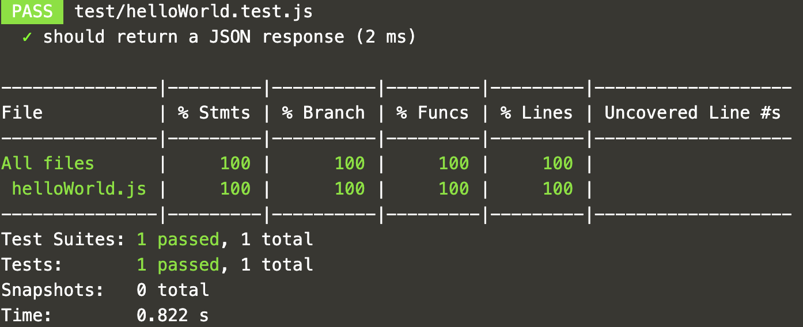

<br>
<details>
  <summary style="color:teal"><b>What is Test Driven Development (TDD)?</b></summary>
  <hr>
Test Driven Development (TDD) is a software development approach where we start by developing the test cases.
These test cases specify and validate what the code will do.
To create new functionality, first write the tests and run the test suite.
At first, the tests will fail.
But, when we add and edit the code, eventually the tests pass.
<hr>
</details>


Open this test file:
<div style="background-color:#cccccc"> **Open** `battlestax/test/helloWorld.test.js`{{open}}</div>

Inspect this simple test - it executes the `helloWorld` function, and expects the resulting JSON value with label _hello_ to have a value of _world_.

Run the test to try it out:

```
$(npm bin)/jest test/helloWorld.test.js --coverage --setupFiles dotenv/config --testEnvironment node
```{{execute}}

When the test passes, you will see something similar to the following:



It's that easy to create and run tests.

## Great! Let's get into creating a real REST endpoint for our app!
