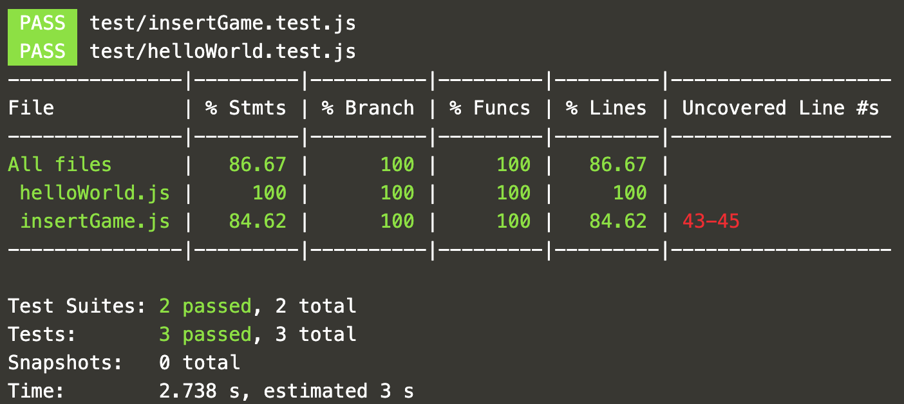

We approach testing by starting with the question "What does our endpoint need to do?"
We want our serverless function to provision a new game on Astra DB -- and we need to provide the API with a random game code so this can work.

<details>
  <summary style="color:teal"><b>What does does our endpoint need to do?</b></summary>
<hr>
Our endpoint needs to:
<b>1.</b> Tell the API to make the game document</br>
<b>2.</b> It should not be able to make a game document without a valid game id</br>
<b>3.</b> If we get a 500 on error (something goes wrong), we should be informed
<hr>
</details>

The test cases in the file `test/insertGame.test.js` will check that these conditions are supported by the function in `functions/insertGame.js`.

<div style="background-color:#cccccc"> **Open** `battlestax/test/insertGame.test.js`{{open}}</div>

Notice that `insertGame` is required as a dependency in our `test.js` file.

We are going to use `faker.js`, a JavaScript library for generating mock data.
This mock data is useful when building and testing our application.
Hence, we require the faker library.

```javascript
const faker = require("faker");
```

✔️  _TEST 1_: Our API should create the game document. We need to test to see if the `insertGame` function actually does that:

```javascript
const gameId = faker.helpers.replaceSymbols("????");

it("should create a game document", async () => {
  const response = await insertGame.handler({
    path: "/functions/insertGame/" + gameId,
    body: '{"user":"me"}',
  });
  expect(response.statusCode).toBe(200);
});
```

We use a simple async function to do this. `faker.helpers.replaceSymbols("????")` creates a sample `gameId` for the path, and some user data in the body. As successful test run will return a `200`.

✔️  _TEST 2_ : Our function must not be able to create a game document without a valid `gameId`

```javascript
it("shouldn't create a game document without a game id", async () => {
  const response = await insertGame.handler({ path: "insertGame" });
  expect(response.statusCode).toBe(400);
});
```
We ensure that our function does not create a game, unless it has been provided with a valid `gameId`.

Now let's run our tests to see if our function works:

```
npm run test:functions
```{{execute T1}}

If the tests pass, you will see something like this:



## Great work! Next we will be checking in on our database.
