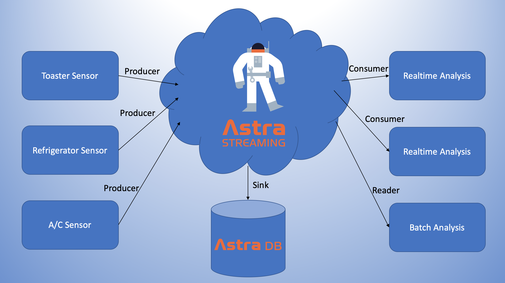

Astra Streaming (DataStax's Apache™ Pulsar-as-a-service offering) lets us produce and consume messages in a reliable and globally scalable manner.

In this scenario, we'll use Astra Stream to:
- Create an Astra Streaming tenant
- Create a topic on the tenant
- Build a message producer
- Build a message consumer
- Build a message reader
- Create an Astra DB sink connector
- Run and observe a streaming system

The streaming system layout looks like this:

As a prerequisite, be sure to setup a free Astra account at [astra.datastax.com](https://astra.datastax.com/register?utm_source=devplay&utm_medium=katacoda&utm_campaign=astra-core-course).

This will be cool! let's get started!
