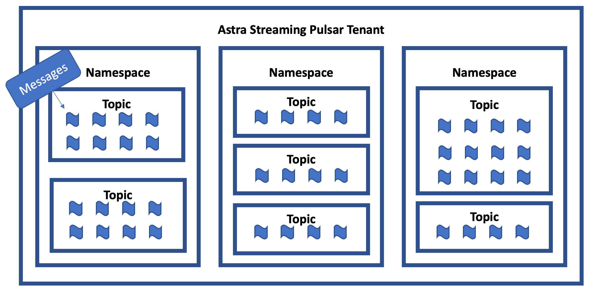
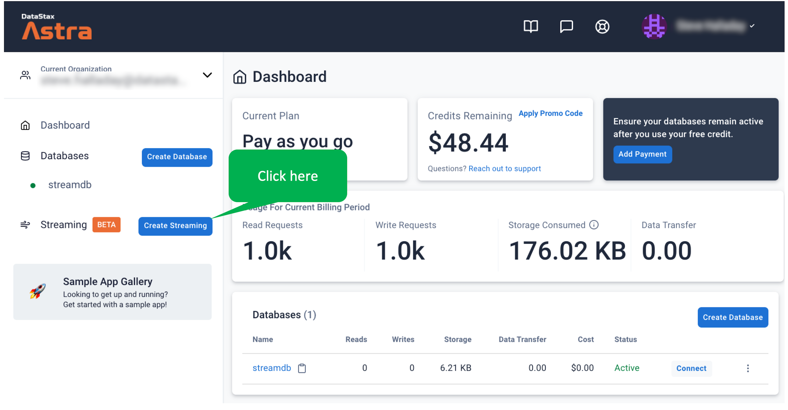
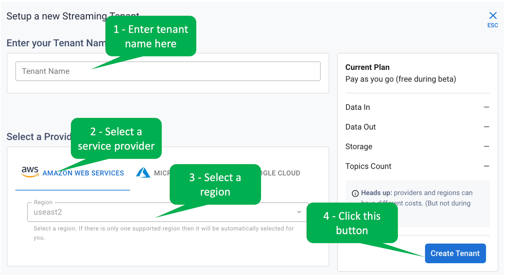

Let's start by creating an Astra Streaming tenant.

  
<b>What are Astra Streaming tenants, namespaces and topics?</b>

  

  Astra Streaming is the DataStax Pulsar-as-a-service offering.
  Pulsar is a streaming and messaging service, which has a hierarchical organization.

  Tenants are the top of the hierarchy - think of them as logical messaging services.
  Tenants contain namespaces, which are just organizing conveniences.
  Namespaces contain topics, which are essentially message queues.

  So, to publish or subscribe to Astra Streaming, you will specify the the tenant, namespace and topic.

  
  

Login to Astra and click on the _Create Streaming_ button.

Fill in the form (name the tenant whatever you like) as shown and click the _Create Tenant_ button.

## Great! You have a tenant!
