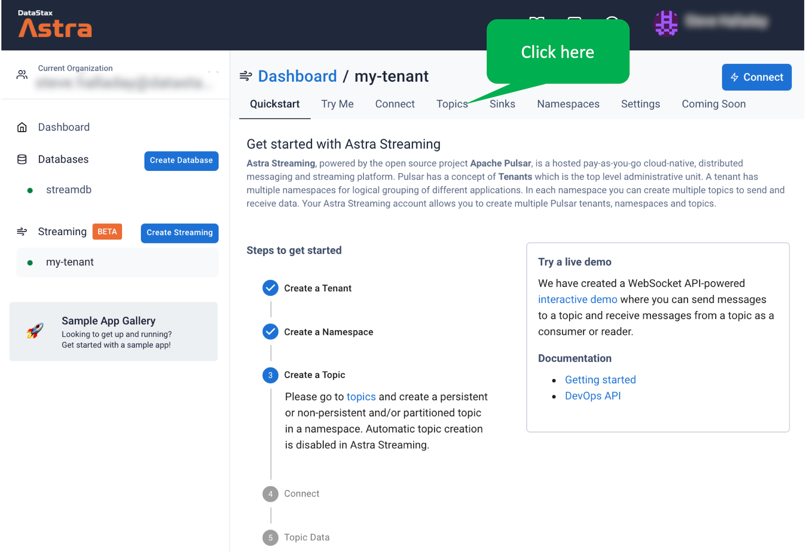
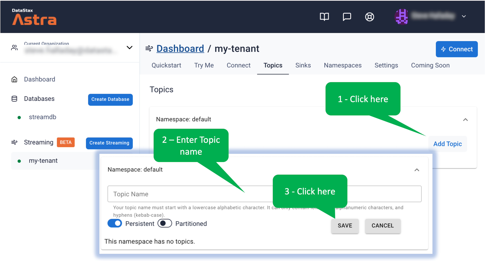

Next we'll create a topic within the tenant.

Click on the _Topics_ tab.

Now, create the topic as shown - name it whatever you like.
This will create a topic in the predefined _default_ namespace.

## Outstanding! Now your tenant contains a topic!
