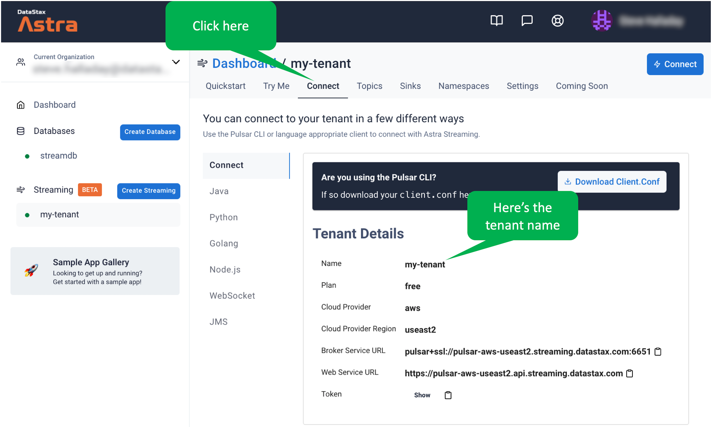
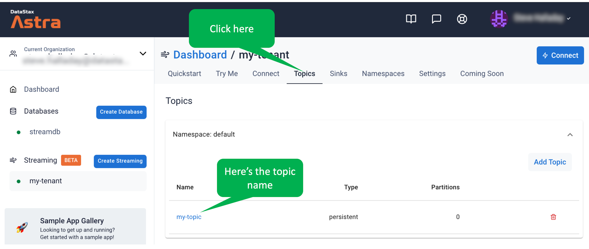
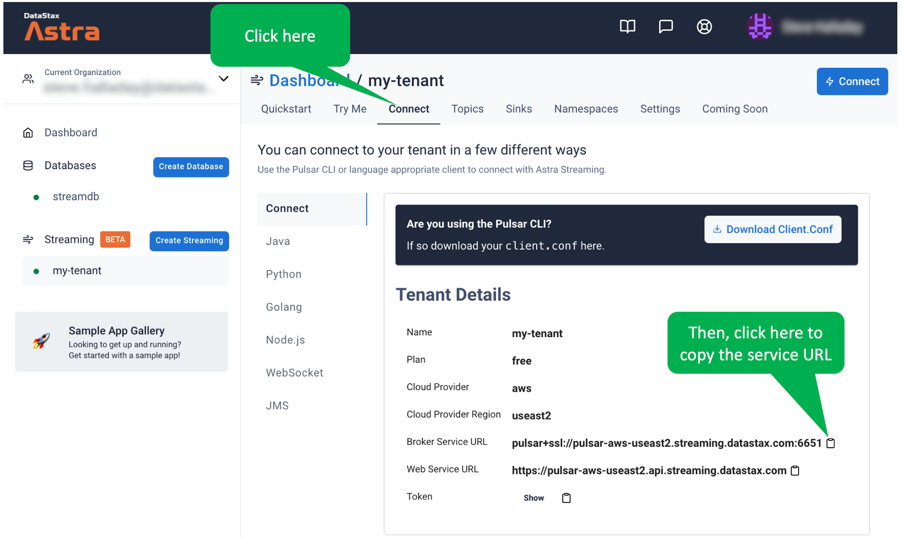
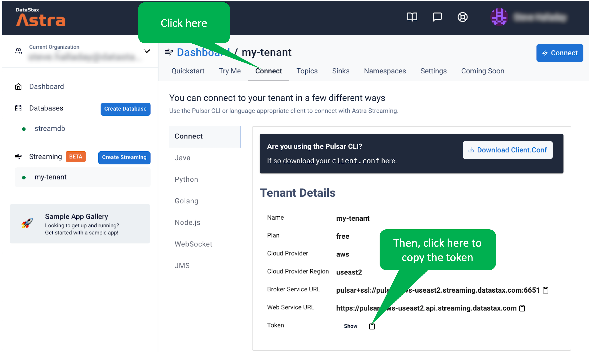

In this step, we'll set up some environment variables for our streaming clients.

Make sure you remember your tenant name.

<details>
  <summary style="color:teal"><b>What if I don't remember my tenant name...</b></summary>
  <hr>
  You can find your tenant name as shown:
  
  <hr>
</details>

Start by creating a variable for the tenant name.
Click the following.
Then, at the end of the command, enter the tenant name and execute the command.

```
export ASTRA_STREAMING_TENANT=
```{{execute  no-newline}}

Next, make sure you remember the topic name.

<details>
  <summary style="color:teal"><b>What if I don't remember my topic name...</b></summary>
  <hr>
  You can find your topic name as shown:
  
  <hr>
</details>

Create a variable containing the topic name.
Click the following and add the topic name to the end of the command before executing.

```
export ASTRA_STREAMING_TOPIC=
```{{execute  no-newline}}

Now, let's create a variable for the service URL.
Copy the service URL from the Astra UI as shown.



Click the following, paste the URL to the end of the command, and execute the command.


```
export ASTRA_STREAMING_SERVICE_URL=
```{{execute  no-newline}}

Let's create a variable for the authentication token.

Copy the streaming token value as shown.



Click the following and paste the streaming token value on the end of the command before executing.

```
export ASTRA_STREAMING_TOKEN=
```{{execute  no-newline}}

Finally, let's save these environment settings in a script so we can reuse them in other terminal windows.
The following command creates a script named _setup.sh_ which contains the necessary variable information.

```
export -p | grep ASTRA > setup.sh
```{{execute}}


## Cool! We're all set to build the code!
