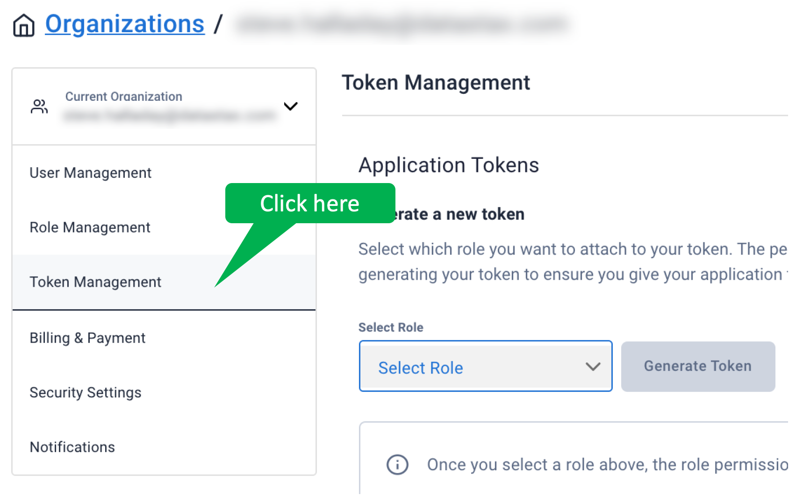
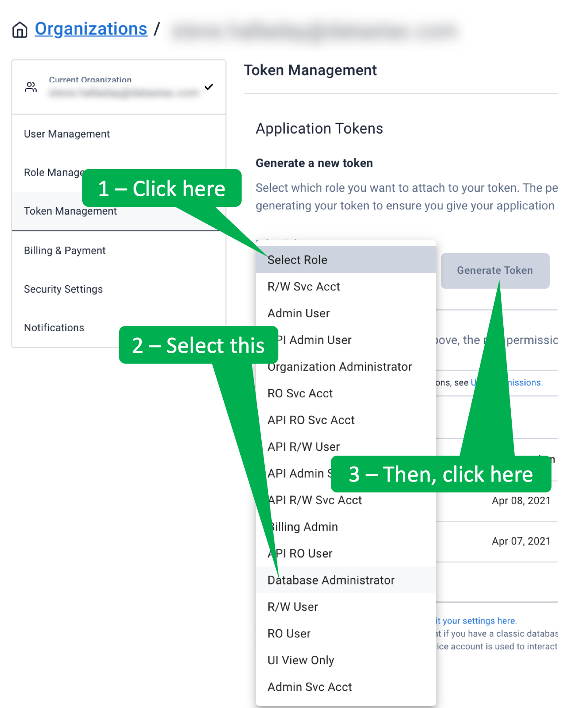

Suppose we want to also save events to Astra DB.
For this we use a _sink_.
We can set one up, but first we need to create a table as the target for the sink.
We'll use Astra DB's REST API to create the table to hold the events.

---

<p><span style="color:teal">***Note:***</span> *
This step assumes you have created an Astra DB database.
*</p>

<details>
  <summary style="color:teal"><b>What if I don't have an Astra DB database yet?</b></summary>
  <hr>
  If you need to create an Astra DB database, this video can help.
  <iframe width="1148" height="300" src="https://www.youtube.com/embed/hzZ3nVrsEpM" title="YouTube video player" frameborder="0" allow="accelerometer; autoplay; clipboard-write; encrypted-media; gyroscope; picture-in-picture" allowfullscreen></iframe>
  <hr>
</details>

---


<details>
  <summary style="color:teal"><b>Step 1. Go to the Connection tab of your Astra DB database.</b></summary>
  <hr>
  From the Astra DB dashboard, click on the database name.
  Then, click the _Connect_ tab.
  <hr>
</details>


<details>
  <summary style="color:teal"><b>Step 2. Copy the environment variables from the Astra DB Connect tab.</b></summary>
  <hr>
  From the _Connect_ tab, click _REST API_ from the navigation on the left.
  Under _Step 2_ of the _Prerequisites_, click the copy icon to copy all the export commands.
  <hr>
</details>


<details>
  <summary style="color:teal"><b>Step 3. Paste the export commands into the terminal.</b></summary>
  <hr>
  Back in the Katacoda terminal, paste the contents of the clipboard at the terminal prompt.
  All but the last of these export commands will execute.
  Do NOT execute the final command yet - we need to replace <i>&lt;app_token&gt;</i> before we can execute it.
  <hr>
</details>


---

<p><span style="color:teal">***Note:***</span> *Do NOT execute the final export command yet!*</p>

---


<details>
  <summary style="color:teal"><b>Step 4. Find the _Organization Settings_.</b></summary>
  <hr>
  From the _Current Organization_ drop-down, select _Organization Settings_.
  <hr>
</details>


<details>
  <summary style="color:teal"><b>Step 5. Access _Token Management_.</b></summary>
  <hr>
  In the left-navigation list, select _Token Management_.
  <hr>
</details>



<details>
  <summary style="color:teal"><b>Step 6. Generate a new application token.</b></summary>
  <hr>
  From the _Select Role_ drop-down menu, select _Database Administrator_.
  Click the _Generate Token_ button.
  <hr>
</details>



<details>
  <summary style="color:teal"><b>Step 7. Copy the application token.</b></summary>
  <hr>
  Click on the clipboard icon near the right edge of the token to copy the token to your clipboard.
  Please note that, as a security precaution, you will only be able to copy this token once.
  So, please take care not to overwrite the token until you have completed the next step.
  <hr>
</details>


<details>
  <summary style="color:teal"><b>Step 8. Replace <i>&lt;app_token&gt;</i> with the application token and execute the command.</b></summary>
  <hr>
  Return to the Katacoda terminal.
  Delete <i>&lt;app_token&gt;</i> at the end of the final _export_ command.
  Paste the copied token into the terminal at the end of the _export_ command and hit enter to execute the command.
  <hr>
</details>


If the application token variable is set correctly, the following command displays the token value.

```
echo $ASTRA_DB_APPLICATION_TOKEN

```{{execute T1}}


Finally, we can use the variables to create the table.
We'll use this cURL command.

```
curl --request POST \
  --url https://$ASTRA_DB_ID-$ASTRA_DB_REGION.apps.astra.datastax.com/api/rest/v1/keyspaces/$ASTRA_DB_KEYSPACE/tables \
  --header "content-type: application/json" \
  --header "X-Cassandra-Token: $ASTRA_DB_APPLICATION_TOKEN" \
  --data '{"name":"temperatures_by_timestamp","ifNotExists":true,"columnDefinitions": [ {"name":"sensor","typeDefinition":"text","static":false}, {"name":"timestamp","typeDefinition":"timestamp","static":false}, {"name":"value","typeDefinition":"int","static":false}],"primaryKey": {"partitionKey":["timestamp"]},"tableOptions":{"defaultTimeToLive":0}}' | jq
```{{execute T1}}

Satisfy yourself that the table is empty by inspecting the contents of the table using cURL.

```
curl --request GET \
    https://$ASTRA_DB_ID-$ASTRA_DB_REGION.apps.astra.datastax.com/api/rest/v2/keyspaces/$ASTRA_DB_KEYSPACE/temperatures_by_timestamp/rows \
    --header "x-cassandra-token: $ASTRA_DB_APPLICATION_TOKEN" \
    | jq
```{{execute T1}}


## Great! Now the table is ready to receive events!
