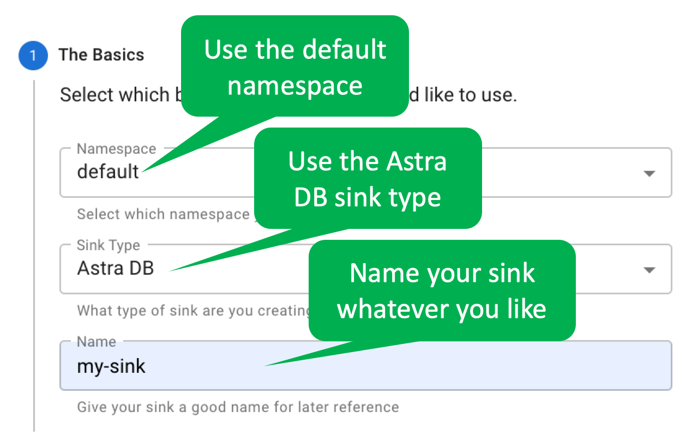
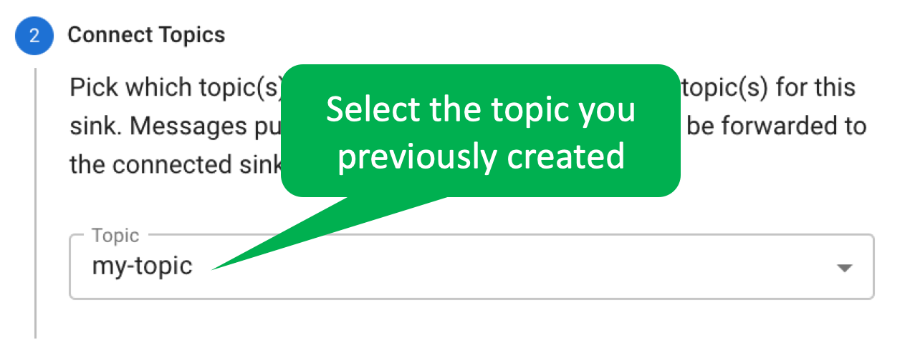
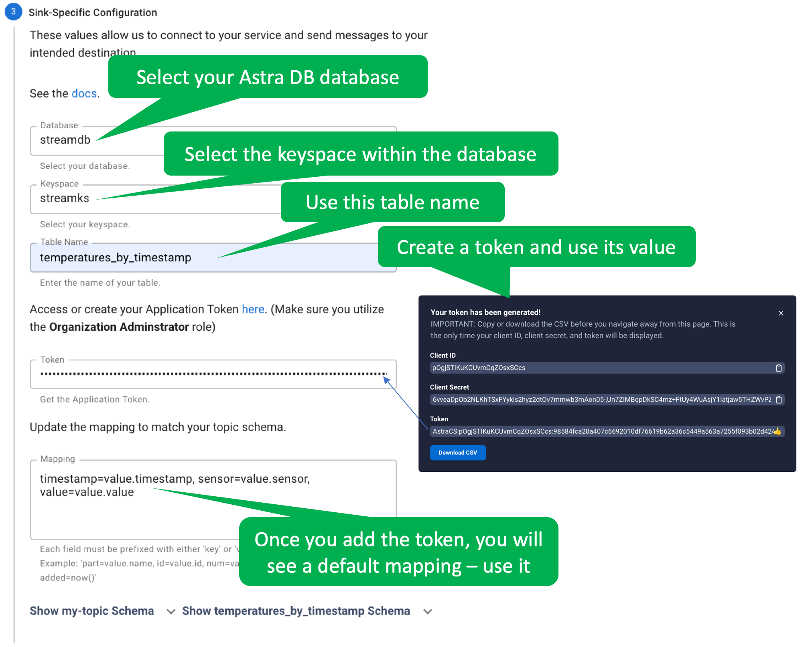

With the table in place, let's set up the Astra Streaming sink.

In the Astra UI, click on your tenant, click on the _Sinks_ tab, and then click _Create Sink_.

Fill out each of the four sections of the form.

Fill out the first section as shown.

Select the topic you created for this exercise.

Fill out the sink-specific values as shown.

Once everything looks correct, click the _CREATE_ button to create the sink.

Love it! You created an Astra DB sink!
